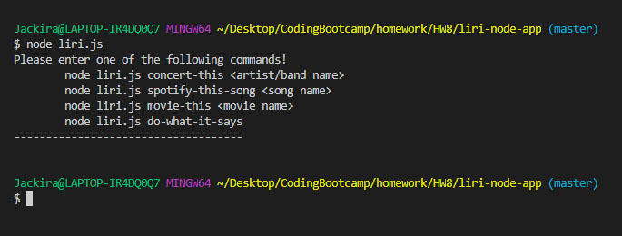

# liri-node-app

### Overview
The is a node.js terminal based application.  Use will need to enter a command on the terminal.  There is no user interface.  After entering the command line, the code will extract command and arguments , then pass the arguments to the right function.

### How to use.
1. User can enter 'node liri.js' to see all available commands.

2. Type "node liri.js concert-this <artist or band> to see event details.  In case of multiple events, it will display maximum 5 events.
3. Type "node liri.js spotify-this-song <song name> to see song detail.
4. Type "node liri.js movie-this <movie name> to see movie detail.
5. Type "node liri.js do-what-it-says" to run the command inside 'random.txt' file. if there are more than 1 command lines in the file, only the 1st line will be read.
6. All output data will be written into "log.txt" file.

### In the code...
    - We use node.js and javascript.
    - Node-Spotify-Api package is used to obtain song information.
    - Axios package is used to read data from and append data to file.
    - Moment package is used for date formatting.
    - DotEnv package is used for setting up key configuration for spotify API. 
    - Bands in Town Artist Events API is used to obtain artist/band information.
    - OMDB API is used to obtain movie information.

### Problems encountered...
    Initially, when we called fs.appendFile to log data into the output file, sometimes, the output text was not in the right order.  This is an issue caused by how the asynchronous function works.  Therefore, instead of calling multiple appendFile() , we created a string to save all data and call appendFile() once.  This solves the issue and also is a good way to handle the file system because the output file is only opened once each command is executed. 