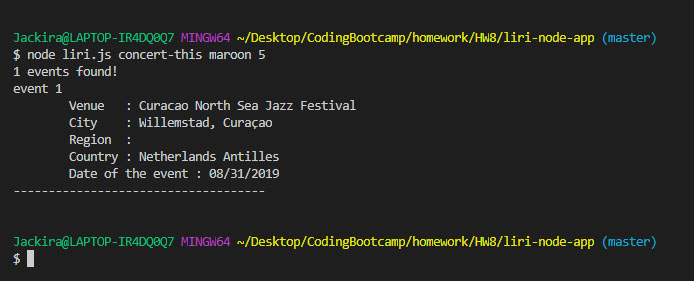
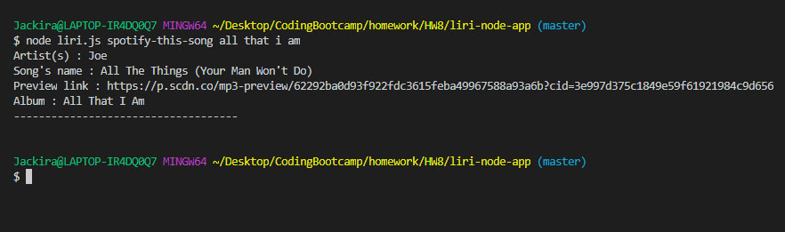
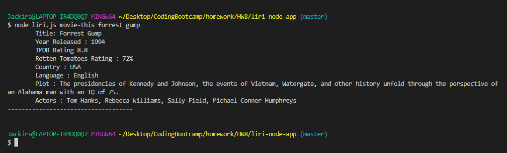
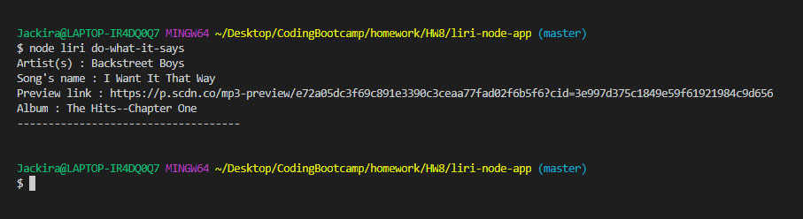
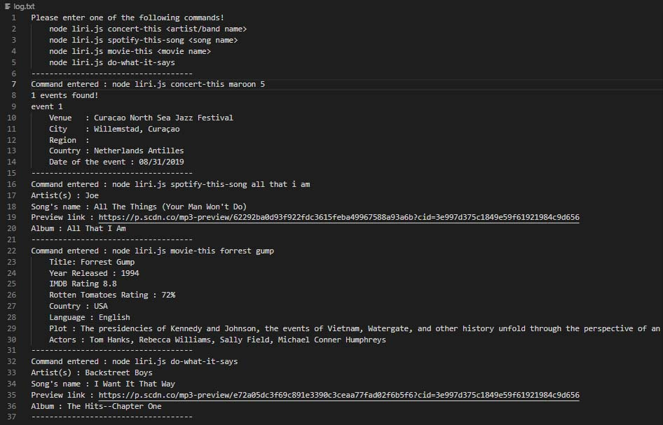

# liri-node-app

### Overview
The is a node.js terminal based application.  Use will need to enter a command on the terminal.  There is no user interface.  After entering the command line, the code will extract command and arguments , then pass the arguments to the right function.

### How to use.
1. User can enter 'node liri.js' to see all available commands.

2. Type "node liri.js concert-this <artist or band> to see event details.  In case of multiple events, it will display maximum 5 events.

3. Type "node liri.js spotify-this-song <song name> to see song detail.

4. Type "node liri.js movie-this <movie name> to see movie detail.

5. Type "node liri.js do-what-it-says" to run the command inside 'random.txt' file. if there are more than 1 command lines in the file, only the 1st line will be read.

6. All output data will be written into "log.txt" file.

---

There is no deployed version of this application since this is a javascript node application running on the terminal.   You can however view , download, and try running the code from github, but you will need to create your own .env for authentication purpose.

---

### In the code...
    - We use node.js and javascript.
    - Node-Spotify-Api package is used to obtain song information.
    - Axios package is used to read data from and append data to file.
    - Moment package is used for date formatting.
    - DotEnv package is used for setting up key configuration for spotify API. 
    - Bands in Town Artist Events API is used to obtain artist/band information.
    - OMDB API is used to obtain movie information.

### Credit
Kanwee Kiatnikorn : Design, Coding, and Testing.
